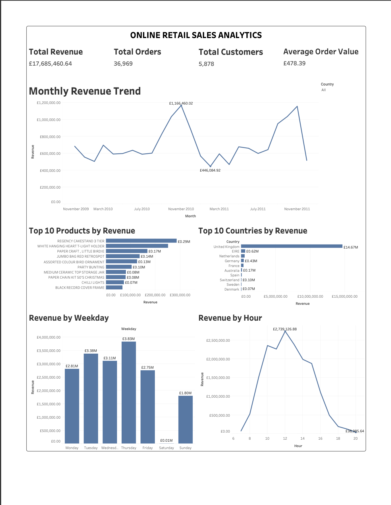

# Online Retail Sales Analytics

## Project Overview

An end-to-end data analytics project that analyzes two years of transaction data from a UK-based online retailer. 

The objective was to clean the raw dataset, evaluate business performance, identify sales trends, understand customer behaviour, and develop business-focused insights using SQL and Tableau. 

Python was used to import and export the data, MySQL was used for data cleaning and analysis, and Tableau was used to create the final dashboard.

## Tools Used

- Python
- Pandas
- MySQL
- SQL
- Tableau

## Dataset

The project uses the Online Retail II dataset, which contains transactions recorded between December 2009 and December 2011.

The original dataset contained more than one million transaction records across two tables.

Only a sample of the cleaned dataset is included in this repository because the complete dataset exceeds GitHub's file-size limit.

## Data Cleaning

The two yearly datasets were first examined separately for:

- Missing values
- Duplicate records
- Cancelled invoices
- Negative or zero quantities
- Negative or zero prices
- Inventory adjustment records

The cleaned tables were created by retaining completed sales transactions with:

- Positive quantity
- Positive price
- Valid customer ID
- Non-cancelled invoice
- Duplicate records removed

The two cleaned tables were then combined into one final table named `retail_clean`.

## Business Overview

The cleaned dataset produced the following key performance indicators:

 Total Revenue        £17,685,460.64 
 Completed Orders     36,969 
 Unique Customers     5,878 
 Average Order Value  £478.39 

## Analysis Performed

### Sales Trend Analysis

- Monthly revenue trend
- Monthly order trend
- Highest revenue month
- Highest order month
- Revenue and orders by weekday
- Revenue and orders by hour

### Product Analysis

- Top products by revenue
- Top products by quantity sold
- Lowest selling products
- Most expensive products
- Average selling price by product
- Products appearing in the highest number of orders

### Customer Analysis

- Top customers by revenue
- Customers with the highest number of orders
- Average revenue per customer
- Average order value per customer
- Revenue contribution by customer
- Quantity purchased by customer
- Customer purchase frequency

### Country Analysis

- Revenue by country
- Orders by country
- Customers by country
- Average revenue per order by country
- Average revenue per customer by country
- Quantity sold by country

### Advanced SQL Analysis

Advanced SQL techniques were used for:

- Common Table Expressions
- Window functions
- Customer revenue ranking
- Top performing product in each country
- Customer segmentation using `CASE`

Customers were classified into VIP, Premium, Regular, and Low Value groups based on their total spending.

## Key Insights

- The business generated approximately £17.69 million in completed sales.
- November 2010 generated the highest monthly revenue.
- Thursday was the highest-revenue weekday.
- Customer activity and revenue peaked around 12:00 PM.
- `REGENCY CAKESTAND 3 TIER` was the highest revenue-generating product.
- Customer ID `18102` generated the highest total customer revenue.
- A small number of high-value customers contributed significantly to overall sales.

## Dashboard

The Tableau dashboard summarizes the major sales, product, customer, and geographical insights identified during the analysis.

